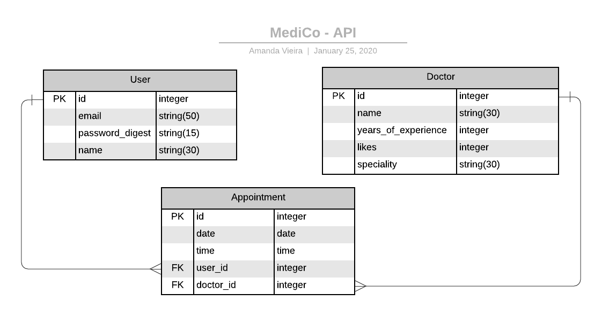

<h1 align="center">Welcome to MediCo API 👋</h1>

> This is a RESTful API CRUD app built with Rails, as a server-side for MediCo React web app.

## Entity Relationship Diagram



The goal is building a real-world-like project, built with business specifications. In which I had to build an MVP before a given deadline.

Find the code for the server-side API can, and the relevant documentation can at [**MediCo**]()

### 🏠 [Homepage]()

### ✨ [Demo]()

## 🔨 Tools

- Rails 5.2.3
- Postgresql

## 🎉 Features

- MVC app.
- RESTfull API endpoints.
- Tests with Rspec.
- Devise for authentication.
- More later...

## 🚀 Getting Started

### Clone

```sh
git git@github.com:vieiramanda11/mediCo-API.git
cd medico-api
```

### Install

```sh
bundle install --without production
```

### Usage

```sh
rails db:migrate
rails db:seed
rails server
```

### Run tests

```sh
rspec
```
## Author

👤 **Amanda Vieira**

- Github: [@vieiramanda11](https://github.com/vieiramanda11)
- Twitter: [@mndvr_](https://twitter.com/mndvr_)
- Linkedin: [Amanda](https://www.linkedin.com/in/amandavieira23/)


## 🤝 Contributing

Contributions, issues and feature requests are welcome!

## Show your support

Give a ⭐️ if you like this project!